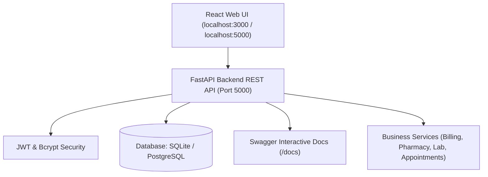

# Enterprise Hospital Management System (HMS)

A production-grade, full-stack Hospital Management System built with **Python FastAPI**, **SQLAlchemy ORM**, **React & Vite**, **Docker**, and **Terraform Infrastructure as Code (IaC)**.

---

## 🌟 Architecture Overview



---

## 🚀 Quick Startup

You can start the entire stack with a single Python command:

```bash
# Clone the repository
git clone https://github.com/Sxnjxy25/Infrastructure-as-Code-for-Hospital-Management-.git
cd Infrastructure-as-Code-for-Hospital-Management-

# Run the unified Python startup script
python start_project.py
# Or on Windows:
py start_project.py
```

---

## 🌐 Endpoints & Ports

| Service | URL | Description |
| :--- | :--- | :--- |
| **Unified Web App** | [http://localhost:5000](http://localhost:5000) | Full Hospital Web UI served directly by FastAPI |
| **React Dev Server** | [http://localhost:3000](http://localhost:3000) | Vite Frontend with Hot Module Replacement (HMR) |
| **Backend REST API** | [http://localhost:5000/api/health](http://localhost:5000/api/health) | Health check & system status |
| **Interactive API Docs** | [http://localhost:5000/docs](http://localhost:5000/docs) | Swagger UI for exploring and testing API endpoints |

---

## 🔑 Demo Login Credentials

Password for all accounts: **`password123`**

| Portal / Role | Email | Capabilities |
| :--- | :--- | :--- |
| **Administrator** | `admin@hospital.com` | Full system control, analytics, department management, staff directory |
| **Doctor** | `dr.smith@hospital.com` | Outpatient queue, consultations, diagnoses, prescription issuance |
| **Receptionist** | `reception@hospital.com` | Patient registration, direct token scheduling, appointment management |
| **Pharmacist** | `pharmacy@hospital.com` | Medicine inventory, automatic stock deduction, low-stock threshold alerts |
| **Lab Technician** | `lab@hospital.com` | Diagnostic investigations, specimen processing, report entry |
| **Accountant** | `billing@hospital.com` | Invoices, cashiering, payment receipts, revenue breakdown |
| **Patient** | `john.doe@patient.com` | Outpatient records, appointments, medical history, invoices |

---

## 🧪 Automated Testing

Run the automated integration test suite in Python:

```bash
python test_system.py
```

---

## 📁 Project Structure

```
.
├── backend/                  # Python FastAPI Backend
│   ├── app/
│   │   ├── config.py         # Settings & environment variables
│   │   ├── database.py       # SQLAlchemy engine & session factory
│   │   ├── models.py         # 14 SQLAlchemy ORM models
│   │   ├── schemas.py        # Pydantic request & response schemas
│   │   ├── auth.py           # JWT & Bcrypt authentication & RBAC
│   │   ├── seed.py           # Python database seeding script
│   │   ├── main.py           # FastAPI application instance & routing
│   │   ├── routers/          # Modular API route controllers
│   │   └── services/         # Transactional business logic
│   ├── requirements.txt      # Python dependencies
│   ├── run.py                # Server runner script
│   └── Dockerfile            # Python container image
├── frontend/                 # React + Vite Web UI
├── docker/                   # Docker Compose, Nginx, and Prometheus configs
├── terraform/                # Terraform Infrastructure as Code (AWS / Cloud)
├── docs/                     # Comprehensive architecture and deployment guides
├── start_project.py          # Universal Python startup launcher
├── push_to_github.py         # Python GitHub deployment automation
└── test_system.py            # Python integration test runner
```
